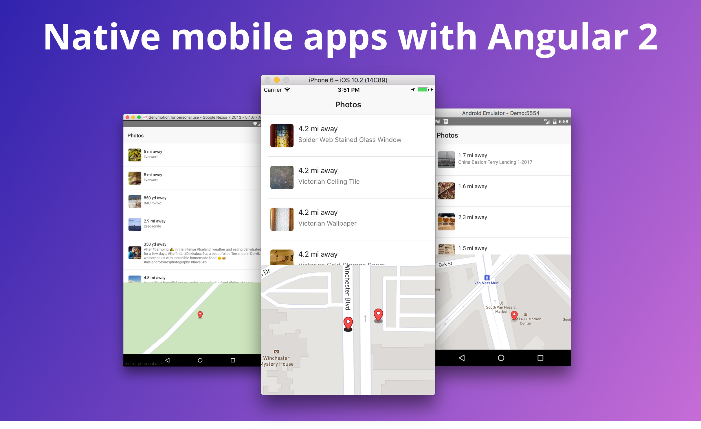
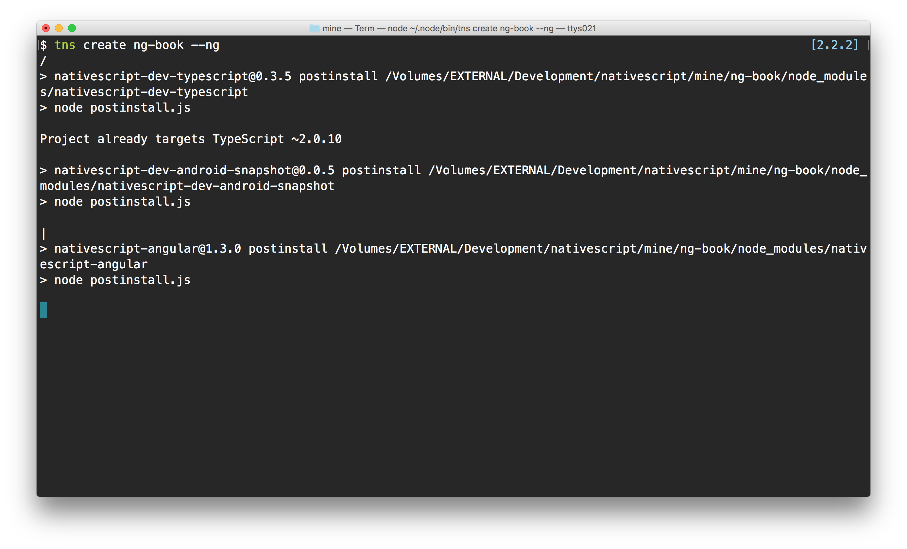

## Mobile app



This is a native mobile application written using [NativeScript](https://www.nativescript.org/), [Angular 2](https://angular.io/), and [TypeScript](https://www.typescriptlang.org/) as part of a demo series provided by the guys at [ng-book](http://ng-book.com/2).

## Quickstart

In order to get things working, we'll need to install the quickstart NativeScript helper. Thanks to `npm`, this is pretty simple to do:

```
npm install --global nativescript
```


Now we can use the freshly installed NativeScript binary (`tns`), to bootstrap a new Angular 2 application.

```
tns create ngBook --ng
```



Now, we'll need to add a platform to work with. Since you need a Mac computer to build an iOS app, we'll work with Android (for the purpose of this email -- but the process for building an iOS app is nearly identical, switching out the platform name android for ios).

In order to run on Android, we need to add the android platform to our application. We can do that using the `tns` tool again:

```
tns platform add android
```


Now we can run the application using the `tns` binary:

```
tns emulate android
```


> You'll need to have an Android emulator installed. Check out the [native emulator](https://developer.android.com/studio/run/emulator.html) or [Genymotion](https://www.genymotion.com/) as two possible emulators to use.

Since we'll want to edit our application and have it reload everytime we make a change, we'll use the `livesync` command instead of the `emulate` command:


With our application running, we can now start editing our application. Notice that the structure the `tns` tool created for us is our familiar Angular 2 structure.


## Contributing
